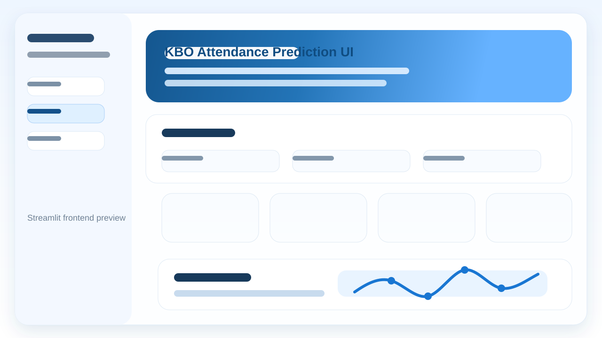

# KBO Attendance Prediction

Deep learning project for predicting KBO baseball game attendance using match conditions and recent home-game trends.



Deploy address: https://kbo-attendance-prediction.streamlit.app/

GitHub address: https://github.com/kwonwooyoung0808-coder/kbo_attendance_prediction

## Project Overview

This project predicts expected attendance for KBO games with a Streamlit frontend and three model approaches:

- `Dense` regression based on match conditions
- `LSTM` prediction based on recent home attendance sequences
- `GRU` prediction based on recent home attendance sequences

Users can choose game conditions in the frontend and review model outputs, summary cards, and recent attendance charts.

## Main Features

- Predict attendance from home team, away team, month, weekday, and holiday inputs
- Compare `Dense`, `LSTM`, and `GRU` model outputs
- Visualize recent 5-game home attendance trends
- Show recent attendance data in both table and chart format

## Input Features

- Home team
- Away team
- Stadium
- Month
- Weekday
- Weekend flag
- Holiday flag
- Rival match flag (`LG` vs `Doosan`)
- Season

## Project Structure

```text
kbo_attendance_prediction/
|-- app.py
|-- train_all_models.py
|-- baseball_attendance_analysis.ipynb
|-- requirements.txt
|-- README.md
|-- assets/
|   `-- frontend-preview.svg
|-- data/
|   `-- kbo_attendance.csv
|-- models/
|   |-- attendance_dense_model.keras
|   |-- attendance_lstm_model.keras
|   `-- attendance_gru_model.keras
`-- artifacts/
    |-- encoders.pkl
    |-- scaler.pkl
    |-- feature_cols.json
    |-- sequence_meta.json
    |-- sequence_recent_games.csv
    |-- model_compare.csv
    |-- model_compare.json
    `-- training_history.json
```

## File Guide

- `app.py`: Streamlit frontend and prediction interface
- `train_all_models.py`: model training script
- `baseball_attendance_analysis.ipynb`: preprocessing, experiments, and visualization notebook
- `data/kbo_attendance.csv`: source attendance dataset
- `models/`: trained model files
- `artifacts/`: encoders, scalers, metadata, and comparison outputs

## Tech Stack

- Python
- Streamlit
- Pandas
- NumPy
- TensorFlow / Keras
- Altair

## Run Locally

```bash
pip install -r requirements.txt
streamlit run app.py
```
